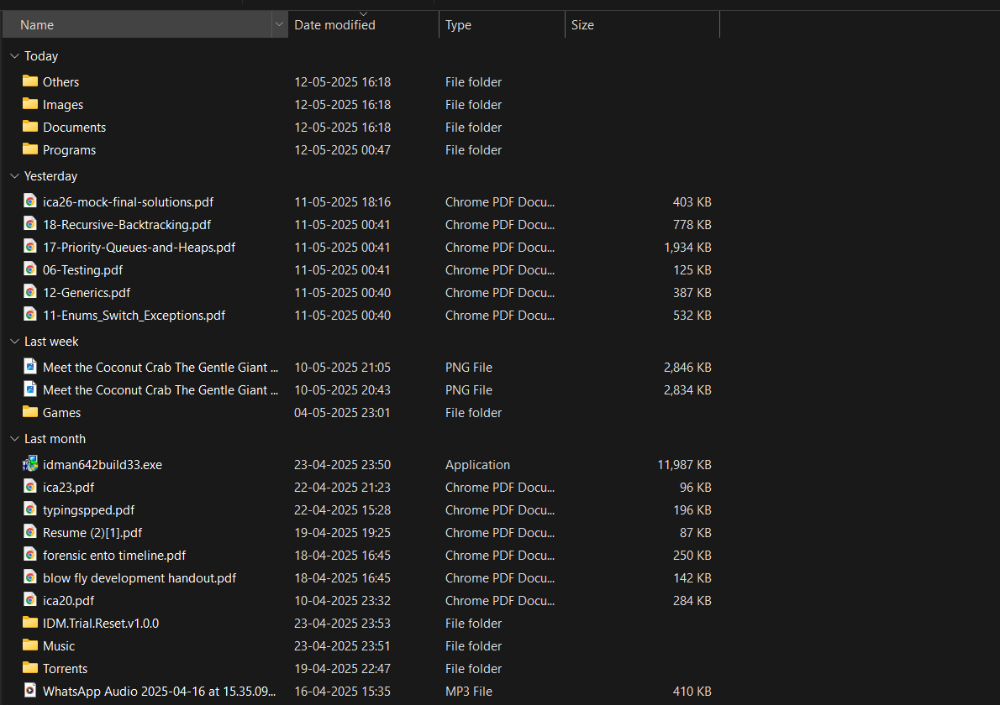
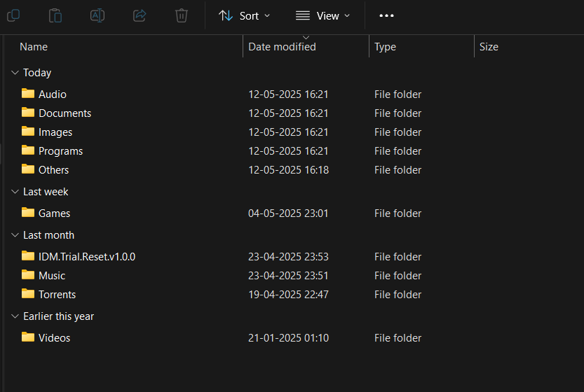

# Download-Folder-Organizer

A Python script to automatically organize your Downloads folder based on file types. This script categorizes your files into appropriate folders (e.g., Images, Documents, Audio, Videos, etc.), making it easier to manage and locate files.

## 🚀 Features

Automatically scans your Downloads folder.
Sorts files into:

- Images (.jpg, .png, .gif, etc.)
- Documents (.pdf, .docx, .txt, etc.)
- Audio (.mp3, .wav, .flac, etc.)
- Videos (.mp4, .mkv, .mov, etc.)
- Programs (.exe, .msi, .dmg, etc.)
- Torrents (.torrent)
- Music (.mp3, .wav, .flac, etc.)
- Others for uncategorized files.

Handles duplicate filenames by appending a counter (file (1).pdf).
Creates folders if they do not already exist.

## 🛠️ Setup Instructions

You can run it in any local Python environment, and copy the code to any file you wish and run it. Or

### 1. Clone the repository:

    git clone https://github.com/manojsaiannapareddy/Download-Folder-Organizer.git

### 2. Navigate to the project directory:

    cd Download-Folder-Organizer

### 3. Run the script:

    python Organizer.py

## 🎯 Before and After

| **Before**            | **After**           |
| --------------------- | ------------------- |
|  |  |

## 🌟 Enjoy a clutter-free Downloads folder!
